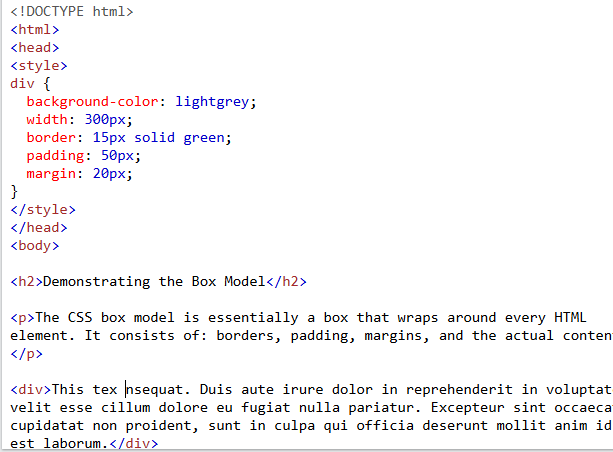

>**Q1.** Explain the difference between inline, internal, and external CSS.

>**Ans.** 
### typs of css he is follows
     (1) inline css
     (2) internal css 
     (3) external css

```html
    (1) inline css

       inline css is very easy, because he is line of the style in the tag.
       inline css style by creating. 

     example. 

    <h2 style="color:red;">i learn website disign</h2>
    <p style="background color:green;">i study website disign in the tops tecnologies</p>

    (2) internal css

        Internal CSS is used to define within style tags for a single HTML page.
        It is defined inside the <head> tag of an HTML page, within a <style> tag element.

     example.
        
        <style>
        p{
            color:red;
            text-align:center;
        }
        </style>
        <body>
        <p>internal css is very easy</p>
        </body>

    (3)external css

        <link> tag
        External stylesheets use the <link> tag inside the head element. The rel attribute
        explains the relation the link has to our document. The value in this case will always 
        be stylesheet , since that is what we're creating a link to. The href attribute is the 
        link to our stylesheet.

     exmaple.
      
      <!DOCTYPE html>
        <html>
        <head>
        <link rel="stylesheet" type="text/css" href="mystyle.css">
        </head>
        <body>

        <h5>This is a heading</h5>
        <u>This is a paragraph.</u>

        </body>
        </html>
       

   ### Explain the top's example of the inline css
```
---

>**Q2.** Describe CSS selectors and list the types of selectors (e.g., element, class,)

>**Ans.**
 
# css selectors
     [1] css element selectors
     [2] universal selectors
     [3] id selectors
     [4] class selector
     [5] Grouping Selector

### (1) the CSS element selectors
     
    css element selectors is very easy, because tag select of the tag . 


      example

        i{
            text-aligh: end;
            background: solid black;
        }

        Explain. the top's example of the css element selectors. i tag meannig is a italic
 

### (2) universal selectors

        css universal selectors is happn all select. and universal selectors using symbol for (*)
      
     example

        p{
        color: green;
        }
        i{
            background: red;
        }

        universal selectors is a select of all tag. top example by Explain the select of p and i .

### (3) id selectors

        (#) symbol for id selector .
        id select does select of only one tag . tag of the name for id name
        id select is in the tag for example.....

        #bhavesh1{
            text-aligh: start;
            background-color: solid black;
        }

        The id of an element is unique within a page, so the id selector is used to select one unique element!

        id select an element with a specific id,(#)by the id of the

### (4) class selectors

        name in the class selector. class of name in the tag. 
         to select tag class write a period(.) class name. for example....

        .bhavesh{
            color: red;
            background-color: green;

        }
        Explain the claa selector by top's example

### (5)Grouping Selector

        group selector is a select by group tag. there many tags in the group selector.
        such as p, i, h1, all of the select. example.....

        h1, u, p{
        text-align: center;
        color: red;
        }
 
>**Q3.** Discuss the CSS box model and its components. 

>**Ans.**
# CSS Box Model

    The box model allows us to add a border around elements, and to define space between elements. 

  ##### 1.  Content => The content of the box, where text and images appear
  ##### 2.  Padding => Clears an area around the content. The padding is transparent
  ##### 3.  Border => A border that goes around the padding and content
  ##### 4.  Margin => Clears an area outside the border. The margin is transparent


## example



